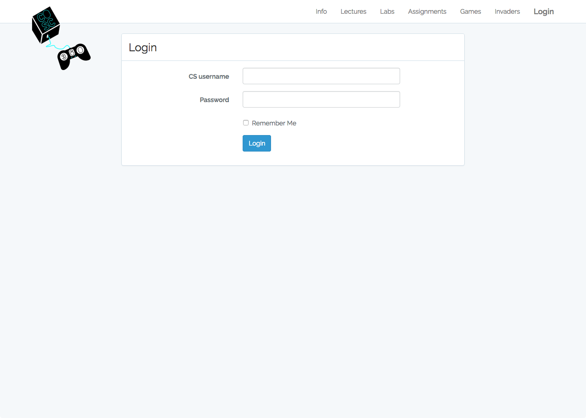
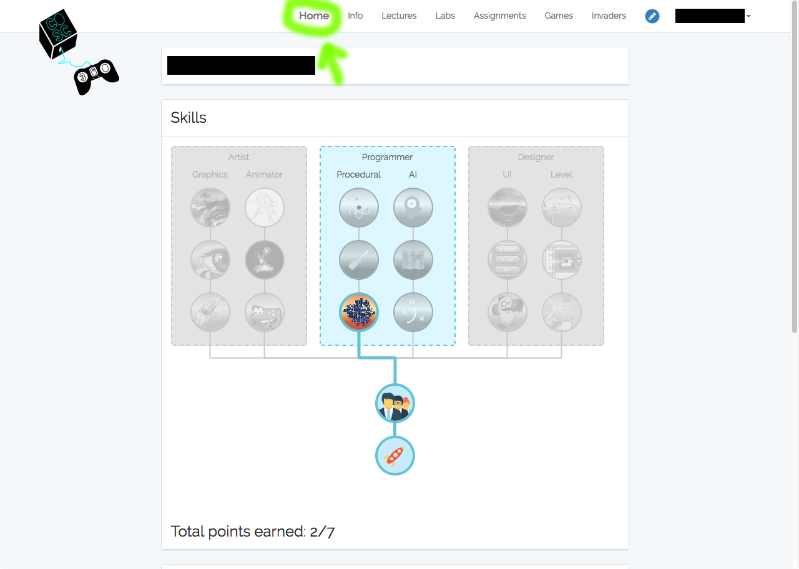
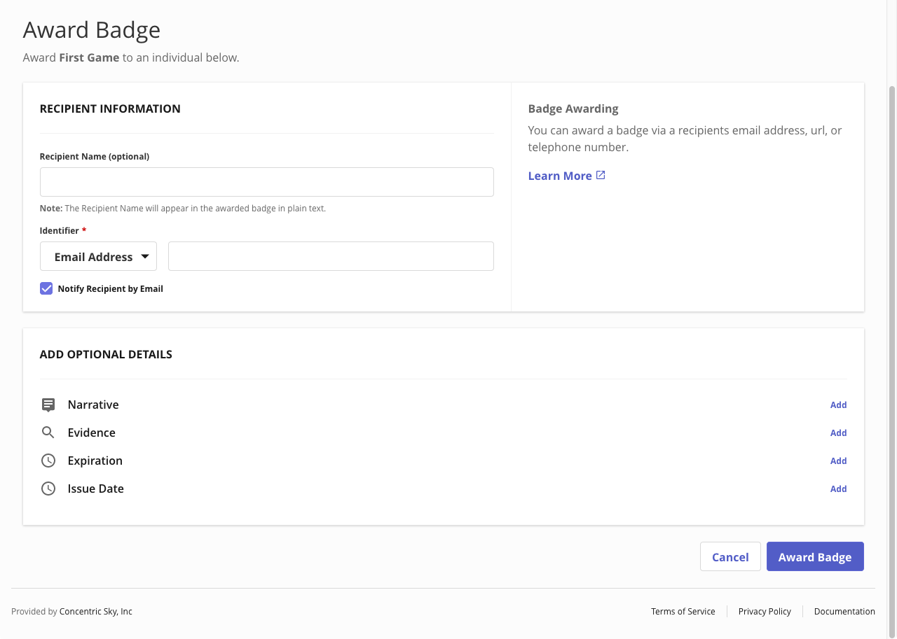

# Using Badgr's free web-based serivce to issue prototype badges for COSC360

The sections below provide step-by-step how-tos for the following tasks:
 - Signing in to/out of `badgr.io`
 - Logging into/out of the `COSC360` records website
 - Creating an *Issuer* in `badgr.io`
 - Creating a *Badge* in `badgr.io`
 - Checking a student's status in the `COSC360` records website
 - Issuing a badge to a student in `badgr.io`

Note that **Issuing Badges** could probably be automated as an extension to the existing `COSC360` records system, such that (assuming an appropriate issuer is set up, and badges have been created) the system could generate and send a badge issue assertion when the records are updated. See https://badgr.org/app-developers/api-guide/#assertion

## Signing-in to Badgr

1. Navigate to the website https://info.badgr.com/. You should see something like this:

2. Click on the "Sign In" button near the top right.

3. This will take you to the sign-in page.

4. Enter your email address in the first textbox.

   - *Optional*: Alternatively, you could use one of the other authentication methods.
     

5. Enter your password in the password textbox.

6. Click the "Sign In" button to the lower right-of-center.

7. You will now be at your list of issuers screen.

## Signing-out of Badgr

This can be done from any page (our example is from the "First Game" badge's page).

1. Click on your profile image at the top right.

2. Click on the "Sign Out" option in the menu that appears.

## Logging-in to the COSC360 records website

1. Navigate to the website https://cosc360.otago.ac.nz/. You should see something like this:

2. Click on the "Login" button at the top right.

3. This will take you to the sign-in page.

4. Enter your Computer Science department username in the first textbox.

5. Enter your password in the password textbox.

6. Click the "Login" button below.

7. You will now see a list of students.

## Logging-out of the COSC360 records website

This can be done from any page (our example is from a student's page).

1. Click on your name at the top right.

2. Click on the "Logout" option in the menu that appears.

## Creating an issuer

1. Log into the `badgr` system (see [badgr sign-in](badgr-sign-in.md)). This should take you to the list of issuers.

2. Click on the "Create Issuer" button near the top right.

3. This will take you to a form for collecting details about the new issuer.

4. *Optional*: Supply an image (*e.g.* a company logo). We have been using `png` files, roughly 128x128 pixels.

5. Enter the issuer's name in the relevant textbox.

6. Enter a website url for the issuer in the relevant textbox.

7. Choose a contact email address for the issuer from the drop-down list (this will be populated by the emails of any users that have access to this account).

8. Write a brief description of the issuer in the relevant textbox.

9. Tick the checkbox (reading the linked "Data Processor Addendum" first, if you have not already).

10. Click on the "Create Issuer" button.

11. This will take you to a page for that issuer (similar to this, but there will be no badges as this is a new issuer). 

12. Log out of `badgr` once complete (see [badgr sign-out](badgr-sign-out.md)).

## Creating a badge

1. Log into the `badgr` system (see [badgr sign-in](badgr-sign-in.md)). This should take you to the list of issuers.

2. Click on the "COSC360 Digital Badge Trial" issuer (there is a "View Issuer" button to the far right, but clicking anywhere on the box containing the issuer will work).

3. This will take you to a list of badges for that issuer.

4. Click on the "Create Badge" button to the right.

5. This will take you to a form for collecting details about the new badge. You will probably need to scroll to see all of it.

6. Supply an image to represent and distinguish this badge. We have been using `png` files, roughly 128x128 pixels.

7. Enter the badge's name in the relevant textbox.

8. Write a brief description of the badge in the relevant textbox.

9. Describe what must be done to earn this badge in the relevant textbox.

   *NB*: Alternatively, the "Earning Criteria" can be entered as a link to a web-page that describes how to earn this badge.

10. *Optional*: Link this badge to an established educational standard (*e.g.* a particular NZQA credit), by clicking "Add" then entering the relevant details.

11. *Optional*: Add subject tags to this badge (*e.g.* for ease of searching), by clicking "Add" then entering the relevant details.

12. *Optional*: Enter the duration of this badge (*i.e.* if it should automatically expire after a certain amount of time), by clicking "Add" then entering the relevant details.

    *NB*: Badges can also be manually revoked, should that prove necessary.

13. Click on the "Create Badge" button at the bottom right.

14. This will take you to a page for that badge.

15. Repeat for each badge as necessary. Clicking the issuer name (under the header) will return to that issuer's page.

16. Log out of `badgr` once complete (see [badgr sign-out](badgr-sign-out.md)).

## Checking students' badge status

1. Log into the `COSC360` records website (see [COSC360 login](cosc360-login.md)). This will take you to the main records page (with the table listing student details).

2. Record the student's email address (*e.g.* via copy-paste) from the table's fifth column.

3. Click on the student's name in the table's second column.

4. You will now be on the student's individual record page.

5. Record any *new* badges that the student has earned. You will need to have recorded which badges they have already been issued in order to make this comparison. Badges they have earned will be in colour, badges they have not (yet) earned will be greyed-out.

6. Repeat as necessary for each student (*i.e.* recording their emails and new badges they have earned). Clicking on "Home" (center top) will return you to the student list.

7. Log out of the `COSC360` records website once complete (see [COSC360 logout](cosc360-logout.md)).

## Issue any new badges

1. Log into the `badgr` system (see [badgr sign-in](badgr-sign-in.md)). This should take you to the list of issuers.

2. Click on the "COSC360 Digital Badge Trial" issuer (there is a "View Issuer" button to the far right, but clicking anywhere on the box containing the issuer will work).

3. This will take you to a list of badges for that issuer.

4. If the required badge is not currently visible, scroll down until it is.

5. Click on the name of the badge you wish to award (*e.g.* First Game).

6. This will take you to that badge's page.

7. Click on the "Award Badge" button

8. This will take you to that badge's awarding page.

9. Enter the student's email address in the Identifier textbox.

   *NB*: For obtaining student records, see [checking status](check-status.md).

   
10. Ensure that the "Notify Recipient by Email" checkbox is ticked.

11. Click on the "Award Badge" button at the bottom right.

12. You will be returned to that badge's page.

13. Repeat for each badge/student as necessary. Clicking the issuer name (under the header) will return to that issuer's page.

14. Log out of `badgr` once complete (see [badgr sign-out](badgr-sign-out.md)).
